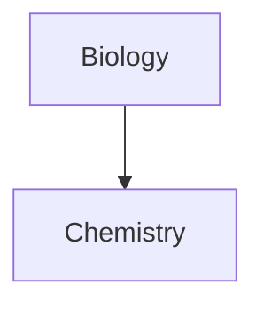

#obsidian-learn


## callout >


> [!note] call to action

>[!info] 

> [!abstract]
> Aliases: `summary`, `tldr`

>[!warning] 
>Aliases: `caution`, `attention`

>[!tip]
> Aliases: `hint`, `important`

>[!question] 
>Aliases: `help`, `faq`
	
>[!todo] 

> [!example] 

> [!success] 
> Aliases: `check`, `done`

> [!failure] 
> Aliases: `fail`, `missing`

> [!danger]
> Alias: `error`

> [!bug]

> [!quote]
> Alias: `cite`

### Foldable callouts

You can make a callout foldable by adding a plus (+) or a minus (-) directly after the type identifier.

A plus sign expands the callout by default, and a minus sign collapses it instead.

```markdown
> [!faq]- Are callouts foldable?
> Yes! In a foldable callout, the contents are hidden when the callout is collapsed.
```
> [!faq]- Are callouts foldable?
> Yes! In a foldable callout, the contents are hidden when the callout is collapsed.

### Customize callouts

[CSS snippets](https://help.obsidian.md/Extending+Obsidian/CSS+snippets) and [Community plugins](https://help.obsidian.md/Extending+Obsidian/Community+plugins) can define custom callouts, or even overwrite the default configuration.

To define a custom callout, create the following CSS block:

```css
.callout[data-callout="custom-question-type"] {
    --callout-color: 0, 0, 0;
    --callout-icon: lucide-alert-circle;
}
```
Instead of using a Lucide icon, you can also use a SVG element as the callout icon.

```css
--callout-icon: '<svg>...custom svg...</svg>';
```


______________________________________

## list 
- level 1
	- level 2
		- level 3
	- level 2
- level 1

# checkbox

- [ ] level 1
	- [x] level 2  [completion:: 2023-10-15]
	- [ ] level 2
- [ ] level 1
- [ ] `[ ] |to-do|
- [/] `[/] |incomplete|
- [x]  [x] |done|
- [-] `[-] |canceled|
- [>] `[>] |forwarded|
- [<] `[<] |scheduling|
- [?] `[?] |question|
- [!] `[!] |important|
- [*] `[*] |star|
- ["] `["] |quote|
- [l] `[l] |location|
- [b] `[b] |bookmark|
- [i] `[i] |information|
- [S]  `[S] |savings|
- [I] `[i] |idea|
- [p] `[p] |pros|
- [c] `[c] |cons|
- [f] `[f] |fire|
- [k] `[k] |key|
- [w] `[w] |win|
- [u] `[u] |up|
- [d] `[d] |down|

## bubble 

- [0] [0] bubble
- [1] [1] bubble
- [2] [2] bubble
- [3] [3] bubble
- [4] [4] bubble
- [5] [5] bubble
- [6] [6] bubble
- [7] [7] bubble
- [8] [8] bubble
- [9] [9] bubble

# level 1 header
## level 2 header

### level 3 header

#### level 4 header

##### level 5 header

###### 6 header


## code block
```
line 1
line 2
line 3
```

##  [Mermaid](https://mermaid-js.github.io/) diagram


 ```mermaid
  sequenceDiagram 
  Alice->>+John: Hello John, how are you? 
  Alice->>+John: John, can you hear me?
   John-->>-Alice: Hi Alice, I can hear you!
    John-->>-Alice: I feel great! 
  ```



You can create [internal links](https://help.obsidian.md/Linking+notes+and+files/Internal+links) in your diagrams by attaching the `internal-link` [class](https://mermaid.js.org/syntax/flowchart.html#classes) to your nodes.

````md

````


If you have many nodes in your diagrams, you can use the following snippet.

````md

````

This way, each letter node becomes an internal link, with the [node text](https://mermaid.js.org/syntax/flowchart.html#a-node-with-text) as the link text.


>[!note] If you use special characters in your note names, you need to put the note name in double quotes.
>```
>class "⨳ special character" internal-link
>```
> Or, `A["⨳ special character"]`.

## Math

You can add math expressions to your notes using [MathJax](http://docs.mathjax.org/en/latest/basic/mathjax.html) and the LaTeX notation.

To add a MathJax expression to your note, surround it with double dollar signs (`$$`).

```md
$$
\begin{vmatrix}a & b\\
c & d
\end{vmatrix}=ad-bc
$$
```
$$
\begin{vmatrix}a & b\\
c & d
\end{vmatrix}=ad-bc
$$

You can also inline math expressions by wrapping it in `$` symbols.

```md
This is an inline math expression $e^{2i\pi} = 1$.
```
This is an inline math expression $e^{2i\pi} = 1$.

## query code block

```md
```query
#daily
	```
```
```

```query
#daily 
```
